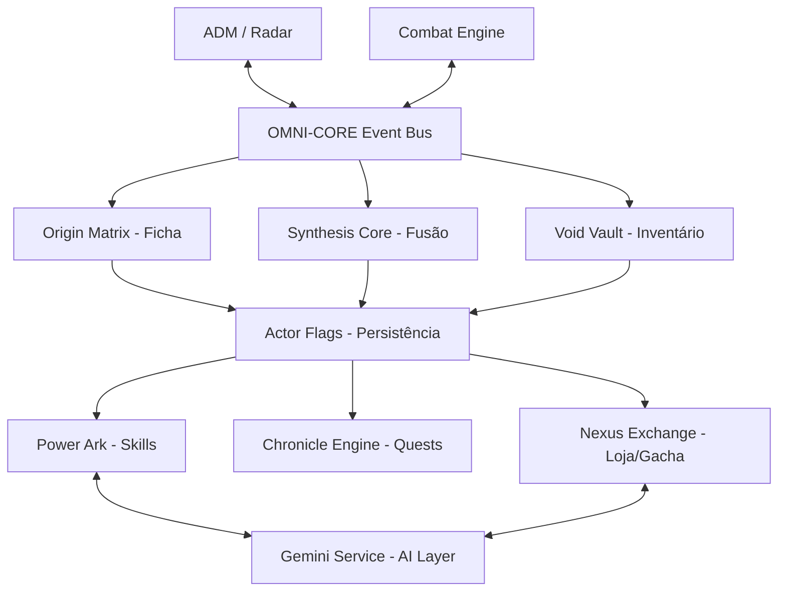

# 🌌 OMINI SYSTEM VTT

  

**O Ecossistema Definitivo para RPG de Animes, Manhwas e VRMMORPGs no Foundry VTT.**

O OMINI SYSTEM é uma estrutura modular projetada para transformar o Foundry VTT em uma interface digna de obras como *Solo Leveling*, *SAO* e *The King's Avatar*. Focado em estética Manhwa Dark, automação fluida e integração total com IA.

---

## ⚙️ ARQUITETURA DO SISTEMA

O OMINI-SYSTEM não é apenas um conjunto de macros; é um **grafo vivo** onde cada módulo interage através de uma fonte única de verdade: os **Actor Flags**.

---

## ⚡ COMO VAI FUNCIONAR (Fluxo Operacional)

Todo HUD e interface do sistema segue um contrato operacional rigoroso para garantir integridade de dados e sincronia entre jogadores:

1. **Resolução de Ator (ActorResolver)**: O sistema identifica automaticamente o personagem alvo (Token Selecionado > Personagem Vinculado > Seleção GM).
2. **Carregamento de Flags**: Os dados são lidos diretamente do banco de dados persistente do ator no mapa de Actor Flags.
3. **Renderização de UI**: A interface é injetada via `ApplicationV2` com reatividade total aos dados.
4. **Interação & Modificação**: Ao interagir com a UI, as Flags do ator são modificadas em tempo real.
5. **Emissão de Eventos**: O `OmniCore` propaga a mudança para todos os outros módulos interessados.
6. **Auto-save com Debounce**: O sistema aguarda 800ms de inatividade do usuário para persistir os dados permanentemente no servidor, exibindo um indicador visual de salvamento.

---

### 🧬 Grafo de Módulos

---

## 📂 ESTRUTURA DO PROJETO

Baseado no **Blueprint de Arquitetura 3.1**, o projeto segue uma organização modular estrita:

- **`core/`**: O sistema nervoso central. Contém o `OmniCore` (Event Bus), `ActorResolver` e `GeminiService`.
- **`sheets/`**: Fichas de Personagem (ApplicationV2) para Players, NPCs e Monstros.
- **`huds/`**: Interfaces flutuantes avançadas (Síntese, Mercado, Arsenal, Codex).
- **`radar/`**: O Absolute Detection Matrix (ADM), sistema de detecção e radar GM.
- **`scripts/utils/`**: Utilitários como o `OmniDbLoader` para sincronização de compêndios.

---

## 🔑 PADRÕES TÉCNICOS (Protocolos MAKO-SYN)

Seguimos protocolos rigorosos para garantir estabilidade e performance:

1. **Fonte Única de Verdade**: Toda persistência utiliza `flags.world.sao_{módulo}_{actorId}`. Dados voláteis em variáveis `window` são terminantemente proibidos.
2. **Event Bus Proprietário**: Módulos comunicam-se via Hooks do Foundry (`omniCore.*`), garantindo desacoplamento total.
3. **Resolução de Ator (ActorResolver)**: Protocolo de prioridade (Token Selecionado > Personagem Vinculado > Diálogo GM) para garantir que comandos nunca falhem por falta de contexto.
4. **Auto-Save Inteligente**: Todo HUD implementa debounce de 800ms com indicador visual de status de salvamento.

---

## 🎨 IDENTIDADE VISUAL (Manhwa Dark)

- **Gold:** `#FFD700` (Legendary/UI Focus)
- **Blue:** `#00D9FF` (Mana/System)
- **Purple:** `#A855F7` (Arcane/Cosmic)
- **Red:** `#FF2B4A` (Danger/HP)
- **Fonts:** Orbitron (Headers), Rajdhani (Body), Exo 2 (Accent).

### Rankings de Poder
- **Rank F a D:** Aventureiros iniciantes.
- **Rank C a A:** Exploradores de elite.
- **Rank S a SSS:** Entidades transcendentais.

---

## 🚀 INSTALAÇÃO

1. No Setup do Foundry VTT, vá em **Add-on Modules**.
2. Clique em **Install Module**.
3. No campo **Manifest URL**, cole:  
   `https://raw.githubusercontent.com/SoftMissT/omini-system-vtt/main/module.json`

> **Requisito Obrigatório:** Certifique-se de ter o módulo `omini-system-assets` instalado e ativo para carregar os ícones e texturas premium.

---

### 🏛️ CRÉDITOS

Desenvolvido por **SoftMissT** com suporte de arquitetura IA:

- **Google Gemini** (Lógica de Fusão e Lore)
- **Midjourney** (Design de Assets)
- **MAKO-SYN04** (Protocolos de Programação)

---

### 🌌 Arise

"Arise. Your journey through the system begins now."
